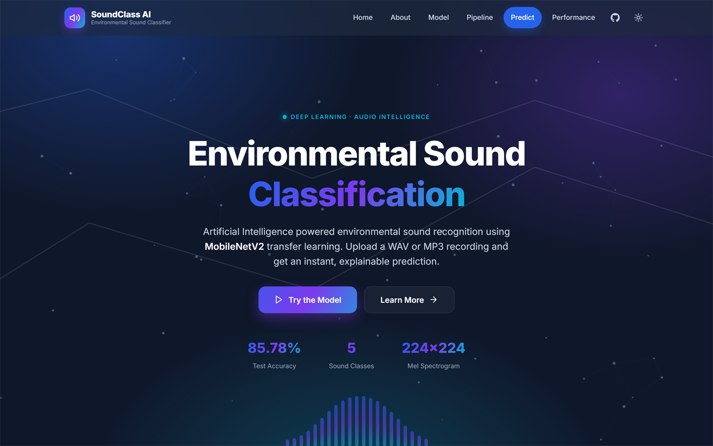
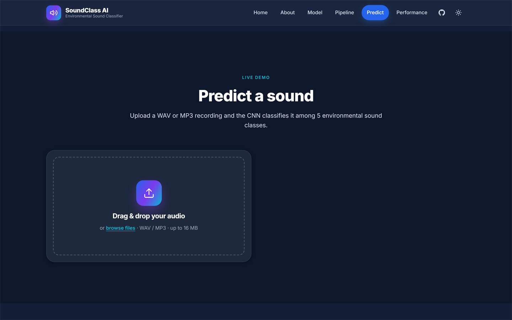
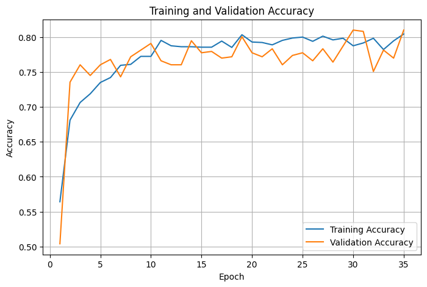
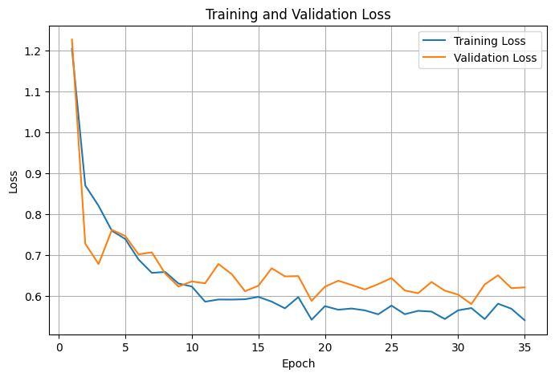
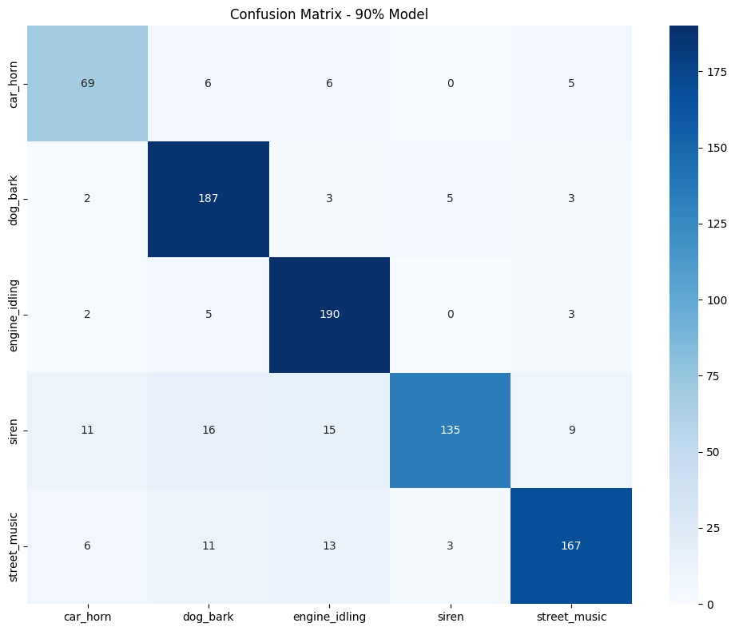

# SoundClass AI

<h4 align="center">Environmental Sound Classification System</h4>

<p align="center">
  
  
  
  
  
</p>

<p align="center">
  An AI that <strong>listens to the world around it</strong> and tells you which
  everyday sound it hears — a barking dog, a car horn, an idling engine, a siren,
  or street music.
</p>

<p align="center">
  <a href="https://soundclassai.onrender.com"><b>Try the live demo</b></a> ·
  <a href="https://github.com/Buzz-brain/soundclassai">Source code</a>
</p>

---

## A look at the app

<p align="center">
  
</p>

That is the app, running live. **https://soundclassai.onrender.com**

---

## In this document

| | |
|---|---|
| [Try it now](#try-it-now) | The fastest way to see the AI in action |
| [What it does](#what-it-does) | The five sounds it recognises |
| [How to use it](#how-to-use-it) | A 30-second guide |
| [Features](#features) | Everything the app offers |
| [How the AI works](#how-the-ai-works) | In plain English |
| [How well it performs](#how-well-it-performs) | Accuracy and training results |
| [Behind the scenes](#behind-the-scenes) | The technology that powers it |
| [Project details](#project-details) | Coursework information |
| [For developers](#for-developers) | Setup, code, and API |

---

## Try it now

Open **https://soundclassai.onrender.com** in any browser — on a phone, tablet,
or computer. No account, no installation, no technical knowledge needed.

1. Click the **Predict** button (or scroll to the upload box).
2. Drag in a sound file — or click to browse. WAV and MP3 both work.
3. Seconds later, the app tells you what it heard and how confident it is.

> **A note on speed:** the free hosting plan lets the server rest during quiet
> periods, so the very first visit after a break can take about a minute to wake
> up. After that, results arrive in a couple of seconds.

---

## What it does

SoundClass AI answers one question: **"What is that sound?"**

Most computer programs understand written words and spoken language, but very
few can make sense of the *noise of the world around us* — the siren in traffic,
the dog barking in the distance, the music drifting out of a street shop. This
system was trained to recognise five of the most common everyday sounds:

| Sound | What it sounds like | Great example to test with |
|-------|---------------------|------------------------------|
| **Car Horn** | A vehicle horn beeping | A recording of a car honking |
| **Dog Bark** | A dog barking or yapping | A video of a dog barking |
| **Engine Idling** | An engine running while parked | A car or bike waiting at a light |
| **Siren** | An emergency vehicle siren | An ambulance passing by |
| **Street Music** | Music playing in public | A speaker busking on the street |

For every upload, the app returns two things:

1. **Which sound it detected** — the most likely match out of the five.
2. **How sure it is** — a confidence percentage, plus the full breakdown of all
   five possibilities.

---

## How to use it

1. **Upload** — drag a sound file into the box, or click to choose one.
2. **The AI listens** — the first four seconds of your recording are analysed.
3. **Read the result** — the named sound, its confidence ring, and a ranked
   breakdown of all five options.

<p align="center">
  
</p>

**Tips for the best results**

- Use at least **four seconds** of audio with a **single, clear sound**.
- Keep the recording focused — lots of overlapping background noise makes the
  task harder (even for human ears).
- Long MP3s are trimmed automatically to the most relevant first four seconds.

---

## Features

| Capability | Why it matters |
|------------|----------------|
| **Drag-and-drop upload** | No forms to fill in — anyone can use it immediately |
| **WAV and MP3 support** | Works with the two most common audio formats |
| **Fast, clear answers** | A named sound and a confidence score in seconds |
| **Full sound breakdown** | See how all five sounds ranked, not just the winner |
| **Confidence ring** | An instant visual read on how sure the AI is |
| **Audio player** | Play your recording back right in the page |
| **Waveform view** | A visual picture of the sound you uploaded |
| **Model dashboard** | A transparent look at how the model was built and tested |
| **Friendly errors** | If a file can't be read, the app explains why — politely |
| **Works on any device** | Responsive design for phones, tablets, and desktops |
| **Dark and light themes** | A comfortable viewing experience, day or night |

---

## How the AI works

In one sentence: **the recording is turned into a picture of the sound, and the
AI decides which of the five sounds that picture looks most like.**

### The journey of your sound

| Step 1 | Step 2 | Step 3 | Step 4 |
|--------|--------|--------|--------|
| **You upload the sound** | **The sound becomes a picture** | **The AI identifies it** | **You see the answer** |
| A WAV or MP3 file | a chart of the pitches in your recording over time | it compares the picture with everything it has learned | the sound name, plus how confident the AI is |

### Why it works

Just as you can recognise a dog's bark by its tone and rhythm, the AI learned
these patterns from **thousands of real recordings** of each sound. Every time
you upload a clip, the app:

1. Turns your audio into a **sound picture** — a chart that shows the different
   pitches in the recording over time.
2. Compares that picture with everything it learned during training.
3. Gives a **score to each of the five sounds**, and shows the winner with a
   confidence percentage.

That is the whole idea. The clever part is *learning*: the AI studied
thousands of labelled examples until it could tell a siren from street music
almost as reliably as a person.

---

## How well it performs

On a set of recordings the model had **never seen before**, it identified the
correct sound **85.78% of the time** — far above the 20% you would expect from
random guessing across five options.

| Test accuracy | Sound classes | Training clips | Audio window |
|---------------|---------------|----------------|--------------|
| **85.78%** | **5** | **4,300+** | **4 seconds** |

### Training results

These charts were produced while the AI was learning, and are the standard way
of verifying that a model is genuinely improving rather than just memorising
examples.

| Training accuracy | Training loss |
|-------------------|---------------|
|  |  |

The chart below shows which sounds the model sometimes mixes up (for example,
how often it mistakes street music for a siren):

<p align="center">
  
</p>

---

## Behind the scenes

The system is built with a clean separation between the "brain" and the "face."

| Layer | What it does | What it uses |
|-------|--------------|--------------|
| **The Face** *(frontend)* | Everything you see and click in the browser | HTML, CSS, JavaScript |
| **The Brain** *(backend)* | Receives your file, analyses it, returns the answer | Python + Flask |
| **The AI Model** | Does the actual listening and classifying | A trained neural network |
| **Audio Analysis** | Turns sound into the picture the AI understands | Open-source audio tools |

---

## Project details

- **Project title:** Environmental Sound Classification System Using
  Convolutional Neural Network (CNN)
- **Department:** Computer Science
- **Student:** (Student Name)
- **Supervisor:** (Supervisor Name)

---

## For developers

<details>
<summary><b>Expand — setup, code structure, and API reference</b></summary>

### Repository and deployment

- **Source code:** https://github.com/Buzz-brain/soundclassai
- **Live deployment:** https://soundclassai.onrender.com (Render free tier,
  kept awake by a scheduled cron job pinging `/api/model-info` every 10 minutes)

### Local setup

```bash
# 1. Create a virtual environment
python -m venv .venv

# 2. Activate it
#    Windows (PowerShell): .venv\Scripts\Activate.ps1
#    macOS / Linux:        source .venv/bin/activate

# 3. Install dependencies
pip install -r requirements.txt

# 4. Run the app
python app.py
```

Open <http://127.0.0.1:5000> in your browser.

**Requirements:** Python 3.11+, and the pinned packages in `requirements.txt`
(Flask, librosa, numpy, scipy, soundfile, soxr, onnxruntime, gunicorn).
TensorFlow/Keras is **not** needed at runtime — the web process serves the model
through ONNX Runtime only, which keeps the deployment small and fast. The Keras
model can be re-exported to ONNX with `tools/convert_to_onnx.py`.

### Project structure

```
soundclassifier/
│
├── app.py                       # Flask entry point (application factory)
├── requirements.txt             # Pinned Python dependencies
├── render.yaml                  # Render (cloud) deployment configuration
├── Procfile                     # Gunicorn start command
├── create_dummy_model.py        # Optional: generates a placeholder model
│
├── backend/
│   ├── config.py                # Centralised configuration
│   ├── routes.py                # REST API blueprint
│   ├── utils.py                 # File helpers and validation
│   ├── preprocessing.py         # Audio → Mel spectrogram pipeline
│   ├── predictor.py             # ONNX model loading + inference service
│   └── model/
│       └── best_model.onnx      # Trained model (ONNX export)
│
├── frontend/
│   ├── index.html               # Single-page interface
│   ├── css/                     # Styles, animations, responsive layout
│   ├── js/                      # UI, upload, prediction, app bootstrap
│   └── assets/images/           # Screenshots and training charts
│
├── tools/
│   └── convert_to_onnx.py       # Keras → ONNX export helper
│
└── uploads/                     # Temporary storage for uploads
```

### REST API

#### `POST /api/predict`

Classify an uploaded audio file. Expects `multipart/form-data` with the field
`audio` (WAV or MP3, max 16 MB, min 0.5 s):

```
curl -X POST https://soundclassai.onrender.com/api/predict \
     -F "audio=@/path/to/dog_bark.wav"
```

Success response (200):

```json
{
  "status": "success",
  "prediction": "Dog Bark",
  "confidence": 99.54,
  "latency_ms": 1407.71,
  "probabilities": [
    { "class": "Dog Bark", "probability": 99.54 },
    { "class": "Street Music", "probability": 0.18 },
    { "class": "Car Horn", "probability": 0.14 }
  ],
  "top_probabilities": [
    { "class": "Dog Bark", "probability": 99.54 },
    { "class": "Street Music", "probability": 0.18 }
  ]
}
```

Error codes:

| Code         | Status | Meaning                                |
|--------------|--------|----------------------------------------|
| `NO_FILE`    | 400    | No `audio` field in the request        |
| `BAD_TYPE`   | 400    | Not a `.wav` or `.mp3` file            |
| `TOO_SHORT`  | 400    | Audio is shorter than 0.5 seconds      |
| `DECODE`     | 400    | File could not be decoded              |
| `TOO_LARGE`  | 413    | Upload exceeds 16 MB                   |
| `MODEL`      | 503    | Model file missing or unreadable       |
| `PREDICTION` | 500    | Inference failed on a valid file       |

#### `GET /api/model-info`

Live model and pipeline metadata (architecture, classes, accuracy, input size).

#### `GET /api/health`

Service health check and model readiness.

### Deployment notes

- The Render build pre-compiles librosa's audio kernels so the app boots quickly
  on the free 0.1-CPU instance, and the model is warmed synchronously at startup
  so the first request is never slow.

</details>

---

## License

For academic and educational use. All third-party libraries retain their
respective licenses.
